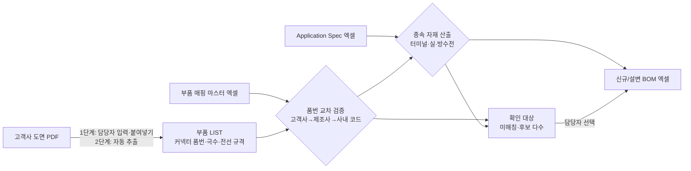

# 하네스 도면 기반 BOM 자동 산출 에이전트 — 프로젝트 기획서

| 항목 | 내용 |
|---|---|
| 리포 | data09-16 |
| 제출자 | 안해식 |
| 직무·소속 | 개발 / 하네스 설계 및 BOM 관리 담당 |
| 과정 | 현장 데이터 디지털화 전문가과정 1차수 |
| 작성일 | 2026-09-28 |
| 문서 상태 | 초안 v0.1 — 수강생 제출 자료 기반 |

---

## 1. 추진 배경과 현안

- 고객사에서 견적 의뢰와 함께 와이어링 하네스 도면(PDF)이 접수되면, 도면에서 부품 LIST를 뽑아 BOM을 구성해야 합니다.
- 도면에 나오는 자재가 많고, **고객사 품번과 제조사 품번이 서로 달라** 사람이 하나씩 매칭합니다. 이 과정에서 인적 오류(Human Error)가 자주 생깁니다.
- 특히 **터미널, 와이어 실, 방수전 같은 종속 자재는 도면에 품번이 빠져 있는 경우가 많습니다.** 설계자가 커넥터 품번과 전선 규격을 일일이 확인해 필요한 자재를 거꾸로 찾아내야 하므로 시간이 많이 듭니다.

현재는 도면을 보며 부품 매핑 마스터 엑셀과 Application Spec 엑셀을 번갈아 찾아보고, 결과를 BOM 엑셀에 손으로 옮겨 적는 방식으로 보입니다(가정). 매칭 기준이 파일에는 있지만 조회와 옮겨 적기가 사람 손을 거치는 것이 오류의 주된 원인으로 보입니다(가정).

## 2. 목표

### 2.1 최종 목표

- 하네스 도면 파일과 자재 마스터 데이터를 넣으면 AI가 품번을 교차 검증하고, 도면에 없는 종속 자재(터미널·실·방수전)까지 산출해 **신규/설변 BOM 엑셀 시트**를 최종 출력하는 통합 시스템(챗봇형 AI 에이전트)
- 도면 → 부품 LIST → 품번 교차 검증 → 종속 자재 산출 → BOM 출력까지 한 흐름으로 처리

### 2.2 1차 개발 목표

- **도면에서 읽은 커넥터 품번·전선 규격을 담당자가 입력(붙여넣기)하면**, 부품 매핑 마스터로 고객사→제조사→사내 코드를 교차 확인하고, Application Spec으로 터미널·실을 규칙대로 산출해 **BOM 엑셀로 내보내는 브라우저 도구**를 먼저 만듭니다.
- **도면 PDF에서 자동으로 부품을 읽어 오는 기능(PDF 파싱·AI 추출)은 2단계**에서 추가합니다. 도면 양식이 고객사마다 다를 수 있어 샘플을 본 뒤에야 추출 방법을 정할 수 있기 때문입니다.
- 매칭이 안 되거나 후보가 여럿인 항목은 자동으로 정하지 않고 **담당자 확인 대상으로 표시**합니다.

## 3. 보유 데이터

| 데이터 | 형태 | 규모·주기 | 비고(민감도 등) |
|---|---|---|---|
| 고객사 도면 | PDF | 견적 의뢰·설계변경 시 수시 접수, 건수·쪽수 미상 | 고객사 설계 정보 — 기밀. 텍스트가 들어 있는 PDF인지 스캔본인지 미상. 커넥터 표·전선 표 형태로 부품이 적혀 있을 것으로 가정 |
| 부품 매핑 마스터 | Excel | 행 수 미상 | 고객사 품번 – 제조사 실제 품번 – 사내 자재 코드 대응표. 열 이름·시트 구성 미상. 고객사별로 시트가 나뉘어 있는지 미상 |
| 커넥터별 자재 종속성(Application Spec) | Excel | 행 수 미상 | 커넥터 품번별 적용 가능한 터미널, 와이어 실, 전선 규격 범위가 매칭된 표. 방수전(더미 플러그 등 — 가정) 포함 여부 미상 |

제출 원문에 첨부 파일은 없습니다. 세 파일의 샘플(민감 정보는 가려도 됨)이 있어야 열 매핑 기본값과 산출 규칙을 확정할 수 있습니다(10장).

## 4. 해결 방안 개요

| 단계 | 내용 |
|---|---|
| 수집 | 도면 PDF, 부품 매핑 마스터 엑셀, Application Spec 엑셀 |
| 정리 | 두 엑셀을 열 매핑으로 표준 형식(매핑표·종속성표)으로 변환 / 도면 부품을 부품 LIST(커넥터 품번, 극수, 회로별 전선 규격)로 입력 |
| 분석 | 품번 정규화(공백·하이픈·대소문자 정리) 후 매핑표 조회, 커넥터 품번 + 전선 규격으로 Application Spec 조회, 수량 계산 |
| AI | 도면 PDF에서 부품 표 추출(2단계), 챗봇형 질의(「이 커넥터에 맞는 실은?」)와 판단 근거 설명(3단계) |
| 산출물 | 신규/설변 BOM 엑셀, 확인 대상 목록, 매칭 근거표 |

## 5. 주요 기능

| 기능 | 설명 | 우선순위 |
|---|---|---|
| 마스터 엑셀 가져오기 | 부품 매핑 마스터·Application Spec 엑셀을 읽고, 실제 열 이름을 표준 항목(고객사 품번, 제조사 품번, 사내 코드, 커넥터 품번, 터미널, 실, 전선 규격 하한·상한 등)에 연결하는 열 매핑 화면 제공. 매핑 설정은 저장해 다음부터 재사용 | MVP |
| 부품 LIST 입력 | 도면에서 읽은 커넥터 품번·극수·회로별 전선 규격을 표에 입력하거나 엑셀에서 복사해 붙여넣기 | MVP |
| 품번 교차 검증 | 고객사 품번 → 제조사 품번 → 사내 코드를 조회해 매칭 결과 표시. 품번 표기 차이(공백·하이픈·대소문자)는 정규화해 비교 | MVP |
| 종속 자재 산출 | 커넥터 품번과 전선 규격으로 Application Spec을 조회해 터미널·와이어 실을 산출. 수량은 회로(사용 극) 수 기준으로 계산(가정 — 사내 규칙 확인 필요) | MVP |
| 확인 대상 표시 | 매핑 없음, 후보 여러 개, 전선 규격이 적용 범위 밖, 한 품번에 사내 코드 여러 개 같은 항목을 사유와 함께 표시하고 담당자가 후보 중 선택 | MVP |
| BOM 엑셀 내보내기 | 확정된 결과를 신규/설변 BOM 엑셀 시트로 저장. 각 행에 근거(어느 마스터 행에서 왔는지) 열 포함 | MVP |
| 방수전 산출 | 사용하지 않는 극(빈 캐비티)에 방수전을 넣는 규칙 적용 | MVP(규칙 확보 시) / 확장 |
| 설변 BOM 비교 | 기존 BOM과 새 BOM을 비교해 추가·삭제·변경 자재 표시 | 확장 |
| 도면 PDF 부품 추출 | PDF 텍스트·표 추출 또는 AI(멀티모달)로 커넥터·전선 표를 읽어 부품 LIST 초안 생성, 담당자 검토 후 확정 | 확장(2단계 1순위) |
| 챗봇형 질의 | 「이 커넥터에 쓸 수 있는 터미널은?」 같은 질문에 마스터 데이터를 근거로 답변 | 확장 |

## 6. 기대 산출물

1. **BOM 산출 도구(브라우저)** — 마스터 엑셀 2종 + 부품 LIST를 넣으면 교차 검증과 종속 자재 산출 실행
2. **신규/설변 BOM 엑셀 시트** — 사내 자재 코드 기준 BOM, 매칭 근거 열 포함
3. **확인 대상 목록** — 미매칭·후보 다수·규격 범위 밖 항목과 그 사유
4. **도면 부품 추출 기능** — 도면 PDF에서 부품 LIST 초안을 만드는 기능 (2단계)
5. **BOM 챗봇(AI 에이전트)** — 도면·마스터를 근거로 질의응답과 BOM 생성을 안내 (3단계)

## 7. 기술 구성

| 과정 도구 | 이 프로젝트에서 쓰는 곳 |
|---|---|
| DAY1 암묵지 자산화·전략기획 | 설계자가 머릿속으로 하던 역산 규칙(「이 전선 굵기면 이 터미널」, 「빈 극에는 방수전」)을 규칙표로 꺼내 적기 — 이 프로젝트의 출발점 |
| DAY2 코랩(Python)·바이브코딩 | 마스터 엑셀 정규화, 매칭·산출 로직 시험, 브라우저 도구 제작 |
| DAY3 멀티모달 비정형 정보화 | 도면 PDF의 커넥터 표·전선 표를 AI로 읽어 부품 LIST 초안 만들기 (2단계) |
| DAY4 RAG (Dify, NotebookLM) | 커넥터 제조사 카탈로그·Application Spec을 근거로 한 질의응답 챗봇 (3단계) |
| DAY5 Make 자동화 | 도면 접수 메일·폴더에서 BOM 산출까지 이어 붙이기 (확장, 보안 허용 시) |
| 생성형 AI | 도면 추출 보조, 확인 대상 사유 설명 문장 |

**개발 형태(권장)**

- **설치 없이 브라우저에서 도는 정적 웹 도구**로 만듭니다. 엑셀을 브라우저 안에서만 읽고 계산하므로 **고객사 도면 정보와 사내 자재 코드가 외부로 나가지 않습니다.** 1단계의 매칭·산출은 규칙 조회라 AI 서비스가 필요 없습니다.
- AI는 **정답을 정하는 곳이 아니라 입력을 돕는 곳**에 씁니다. 도면 추출 결과는 항상 담당자가 확인한 뒤 매칭 단계로 넘깁니다. 품번 한 글자 오독이 곧 잘못된 자재 발주로 이어질 수 있기 때문입니다.
- 도면을 외부 AI 서비스에 올려도 되는지는 확인이 필요합니다(10장). 허용되지 않으면 텍스트가 들어 있는 PDF만 브라우저 안에서 텍스트 추출하는 방식으로 제한합니다.

## 8. 개발 단계

### 1단계 — 지금 바로 개발 가능한 부분

도면 자동 판독 없이도, **도면에서 읽은 값만 있으면 판정할 수 있는 매칭·산출 부분**은 샘플을 받기 전에 먼저 만들 수 있습니다.

- **마스터 엑셀 가져오기** — 부품 매핑 마스터와 Application Spec 엑셀을 올리고, 실제 열 이름을 표준 항목에 연결하는 열 매핑 화면. 실제 열 구성을 모르므로 매핑은 사용자가 고르게 하고, 설정은 브라우저에 저장해 재사용합니다.
- **부품 LIST 입력** — 커넥터 품번, 극수, 회로별(또는 극별) 전선 규격(굵기·종류)을 표에 입력하거나 엑셀에서 복사해 붙여넣기.
- **품번 교차 검증** — 고객사 품번 → 제조사 품번 → 사내 코드 조회. 품번 정규화 후 비교하고, 정규화로 맞춰진 경우는 「표기 차이로 매칭됨」으로 따로 표시합니다.
- **종속 자재 산출** — 커넥터 품번 + 전선 규격으로 Application Spec을 조회해 터미널·와이어 실을 산출하고, 산출된 자재도 다시 매핑 마스터로 사내 코드를 붙입니다. 전선 규격이 적용 범위 경계에 걸리는 경우의 처리 기준은 담당자 확인 후 확정합니다.
- **확인 대상 표시** — 미매칭 / 후보 여러 개 / 전선 규격 범위 밖 / 사내 코드 중복을 사유별로 표시하고, 후보가 있으면 담당자가 고르게 합니다. 확인 대상이 남아 있으면 내보내기 전에 경고합니다.
- **BOM 엑셀 내보내기** — 사내 코드·품명·수량·구분(커넥터/터미널/실/방수전/전선 등)과 근거 열을 담은 BOM 시트. 실제 BOM 양식을 받으면 열 순서를 그에 맞춥니다.
- 시험용으로는 가상의 매핑 마스터·Application Spec·부품 LIST를 만들어 일부러 문제(없는 품번, 하이픈만 다른 품번, 범위 밖 전선 규격, 후보가 두 개인 커넥터)를 넣고 도구가 빠짐없이 잡는지 확인합니다.

### 2단계

- 실제 마스터 엑셀·BOM 양식 샘플로 열 매핑 기본값과 내보내기 양식 확정
- **도면 PDF 부품 추출** — 텍스트가 있는 PDF는 표 추출, 스캔본이나 표 구조가 복잡한 도면은 AI(멀티모달) 추출로 부품 LIST 초안 생성 → 담당자 검토 화면에서 수정 후 확정
- 방수전 규칙(빈 극 수 계산 등)과 기타 종속 자재 규칙 반영
- 설변 BOM 비교(기존 BOM 대비 추가·삭제·변경 표시)

### 3단계

- 챗봇형 AI 에이전트 — 도면·마스터 데이터를 근거로 질의응답과 BOM 산출 안내(Dify 등, 보안 허용 시)
- 고객사별 도면 양식 프로필(고객사마다 부품 표 위치·표기 방식을 등록해 추출 정확도 향상)
- 매칭 실패 이력을 모아 마스터 데이터 보완 목록 생성, 견적 산출과의 연결(확장)

## 9. 기대 효과

- **인적 오류 감소** — 품번 조회와 옮겨 적기를 도구가 하므로, 사람이 틀리기 쉬운 단계가 줄어듭니다.
- **종속 자재 누락 방지** — 도면에 없는 터미널·실을 규칙으로 빠짐없이 산출하고, 판정할 수 없는 항목은 확인 대상으로 드러냅니다.
- **BOM 작성 시간 단축** — 커넥터·전선 규격을 일일이 확인해 역산하던 시간이 줄어듭니다.
- **판단 근거 기록** — BOM 각 행이 어느 마스터 행에서 왔는지 남아, 검토와 인계가 쉬워집니다.
- **마스터 데이터 품질 개선** — 매칭 실패 항목이 모이면 매핑 마스터에서 빠진 품번이 드러납니다.

제출 자료에는 정량 수치가 없어 이 문서도 수치를 적지 않습니다.

## 10. 확인 필요 사항

**샘플 데이터 (필수)**

1. 부품 매핑 마스터 엑셀 샘플 — 열 이름, 시트 구성(고객사별로 나뉘는지), 한 고객사 품번에 제조사 품번이 여러 개인 경우가 있는지
2. Application Spec 엑셀 샘플 — 커넥터 품번별로 터미널·실·전선 규격 범위가 어떻게 적혀 있는지(한 행에 한 조합인지, 한 칸에 여러 품번이 들어 있는지), 전선 규격 단위(sq·mm²·AWG 등)
3. 고객사 도면 PDF 샘플 1~2건 — 부품이 적힌 위치(커넥터 표·전선 표·BOM 란), 텍스트가 선택되는 PDF인지 스캔본인지
4. 해당 도면으로 실제 작성한 BOM 1건 — 도구 결과와 대조할 정답이자 내보내기 양식 기준

**산출 규칙**

5. 터미널·실 수량 계산 기준 — 사용 극 수 기준인지, 회로(전선) 수 기준인지, 여유분(로스율)을 더하는지
6. 방수전을 넣는 기준 — 빈 극마다 넣는지, 방수 커넥터에만 넣는지, 방수전 품번이 Application Spec에 있는지
7. 한 커넥터·전선 규격에 적용 가능한 터미널·실이 여러 개일 때의 우선 선택 기준(사내 표준품, 재고, 고객 지정 등)
8. 터미널·실 외에 도면에서 빠지는 종속 자재가 더 있는지(리테이너, 캡 등 — 가정)
9. 「신규 BOM」과 「설변 BOM」의 양식 차이와 설변 때 꼭 표시해야 할 항목

**보안·환경**

10. 고객사 도면과 마스터 데이터를 외부 AI나 클라우드(코랩 포함)에 올려도 되는지 — 안 되면 브라우저 전용으로만 진행
11. 한 도면당 커넥터·회로 수의 일반적인 규모와 한 달 접수 건수(자동화 우선순위 판단용)

## 부록. 제출 원문 요약

| 출처 | 파일·게시물 | 내용 |
|---|---|---|
| 패들릿 게시물 1 (2026-09-28T08:15) | 「고객사 견적 의뢰 도면 부품list 파악」 — `기획_원문.md` | 직무·소속(개발 / 하네스 설계 및 BOM 관리 담당), 현안(하네스 도면 기반 부품 LIST 작성 및 BOM 구성 자동화, 고객사-제조사 품번 상이로 인한 수작업 매칭 오류, 도면에 누락된 터미널·와이어 실·방수전 수동 역산), 보유 데이터(고객사 도면 PDF, 부품 매핑 마스터 엑셀, Application Spec 엑셀), 기대 산출물(하네스 도면 분석 및 BOM 자동 산출 챗봇 — 신규/설변 BOM 엑셀 시트 출력) |

첨부 파일은 제출되지 않았습니다(`attachments.json` 비어 있음).
