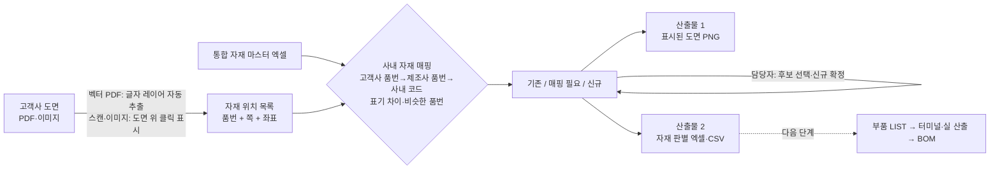

# 하네스 도면 자재 판별·BOM 자동 산출 에이전트 — 프로젝트 기획서

| 항목 | 내용 |
|---|---|
| 리포 | data09-16 |
| 제출자 | 안해식 |
| 직무·소속 | 개발 / 하네스 설계 및 BOM 관리 담당 |
| 과정 | 현장 데이터 디지털화 전문가과정 1차수 |
| 작성일 | 2026-09-28 (v0.1) · 2026-09-29 (v0.2) |
| 문서 상태 | **v0.2 — 수강생 수정 기획으로 1차 목표 재설정** (11장). v0.1 의 BOM 산출 범위는 「다음 단계」(8장)로 옮김 |

## 판 기록

| 판 | 날짜 | 바뀐 것 |
|---|---|---|
| v0.1 | 2026-09-28 | 패들릿 첫 제출 기반 초안. 1차 목표 = 커넥터 품번·전선 규격 입력 → 품번 교차 검증 → 터미널·실 산출 → BOM 엑셀 |
| **v0.2** | 2026-09-29 | 수강생이 「기존 현안과 산출물은 복잡하고 변수가 많아」 1차 목표를 다시 잡음. **1차 목표 = 신규 도면 전 자재의 사내 자재 매핑 + 도면 위 신규 여부 시각화 + 자재 데이터 독립 추출.** 터미널·실·방수전 산출과 BOM 출력은 다음 단계로 이동 |

**v0.1 범위를 다음 단계로 옮긴 이유**

- 수강생이 직접 「변수가 많다」고 판단했습니다. 종속 자재 산출은 수량 기준·방수전 기준·후보 우선순위(v0.1 10장 5~8번)가 모두 확인 전이라, 규칙이 정해지기 전에는 결과를 믿고 쓰기 어렵습니다.
- 새 1차 목표(도면 자재 매핑·신규 판별)는 **v0.1 흐름의 앞 단계**입니다. 도면에서 자재를 빠짐없이 뽑아 사내 코드와 맞추는 일이 끝나야 BOM 산출의 입력(부품 LIST)이 생깁니다. 순서를 바꾼 것이지 목표를 버린 것이 아닙니다.
- 이미 만든 1단계 BOM 도구(마스터 열 연결·교차 검증·터미널·실 산출·BOM 엑셀)는 지우지 않고 도구 안에 「BOM 산출(다음 단계)」 메뉴로 그대로 둡니다.

---

## 1. 추진 배경과 현안

- 고객사에서 신규 도면(PDF 또는 이미지)이 접수되면 **도면 안의 전 자재(커넥터·클립·그로멧·튜브·테이프 등)를 사내 자재 데이터와 맞추고, 사내에 없는 신규 자재를 가려내야** 합니다.
- 고객사 품번과 제조사 품번·사내 자재 코드가 서로 달라, 지금은 사람이 도면과 통합 자재 마스터 엑셀을 번갈아 보며 하나씩 맞춥니다(v0.1 1장과 같은 문제).
- 수강생이 짚은 핵심은 **결과물의 형태**입니다.
  - 추출된 **텍스트 목록만** 주면 도면에서 그 자재가 어디 있는지 다시 찾아야 합니다.
  - 반대로 **도면 위에 표시만** 해 두면 후행 업무(BOM·발주·신규 자재 등록)를 할 때 데이터를 다시 타이핑해야 합니다.
  - 그래서 **도면 위 시각화와 자재 데이터 독립 추출이 동시에** 이루어져야 합니다.

터미널·와이어 실·방수전처럼 도면에 품번이 빠진 종속 자재를 역산하는 문제(v0.1 현안)는 그대로 남아 있으며 8장 다음 단계에서 다룹니다.

## 2. 목표

### 2.1 최종 목표

- 하네스 도면과 자재 마스터를 넣으면 도면 자재를 사내 코드로 맞추고, 도면에 없는 종속 자재(터미널·실·방수전)까지 산출해 **신규/설변 BOM 엑셀**을 출력하는 통합 시스템(챗봇형 AI 에이전트) — v0.1 과 같음
- 도면 → **자재 추출·매핑·신규 판별(1차 목표)** → 부품 LIST → 종속 자재 산출 → BOM 출력

### 2.2 1차 목표 (v0.2)

**신규 도면 내 전 자재의 사내 자재 매핑, 도면 위 신규 여부 시각화, 자재 데이터 자동 추출**을 한 화면에서 합니다.

- **도면 불러오기** — PDF(글자가 들어 있는 벡터 도면)는 텍스트 레이어에서 품번 후보를 **좌표와 함께** 자동으로 뽑습니다. 스캔본·이미지는 도면 위를 눌러(또는 끌어) 자재 위치를 표시하고, 품번은 직접 입력하거나 AI 가 읽은 목록을 붙여 넣어 차례로 배치합니다.
- **사내 자재 매핑** — 통합 자재 마스터(부품 분류·사내 자재 코드·제조사 품번·고객사별 품번)와 대조해 각 자재를 세 가지로 판별합니다.
  - **기존 자재(초록)** — 이 고객사 품번 또는 제조사 품번·사내 코드로 사내 자재 하나에 맞춰짐
  - **매핑 필요(노랑)** — 마스터에 흔적은 있으나 사내 코드 하나로 정할 수 없음(후보 여러 개, 사내 코드 빈칸, 다른 고객사 품번으로만 등록, 비슷한 품번만 있음)
  - **신규 자재(빨강)** — 마스터에 같은 품번도 비슷한 품번도 없음
  - (도구 보조 상태) **품번 미입력(회색)** — 위치만 표시하고 품번을 아직 넣지 않음
- **산출물 1 · 표시된 도면 이미지** — 도면 위에 상태별 사각형(Bounding Box)과 번호 라벨을 겹쳐 PNG 로 저장합니다. 색만으로 구분하지 않도록 **선 모양(실선·점선·겹선+빗금)과 글자 라벨을 함께** 씁니다(색약 고려).
- **산출물 2 · 자재 판별 데이터** — 수강생이 정한 순서 **[자재 종류 | 도면 표기 품번 | 매핑된 사내 자재 코드 | 신규 여부]** 에 판별 근거·쪽·좌표를 붙인 엑셀/CSV 를 따로 내보냅니다.
- **두 산출물은 같은 번호로 이어집니다.** 도면 라벨의 번호 = 표의 번호 = 엑셀의 번호이고, 화면에서는 표 행을 누르면 도면의 그 위치로, 도면 표시를 누르면 표의 그 행으로 갑니다.
- 매핑이 애매한 항목은 **자동으로 정하지 않고** 담당자가 후보를 고르거나 신규로 확정합니다(v0.1 원칙 유지).

## 3. 보유 데이터

| 데이터 | 형태 | 규모·주기 | 비고(민감도 등) |
|---|---|---|---|
| 고객사별 신규 접수 도면 | **PDF 또는 이미지** | 신규 접수 시 수시, 건수·쪽수 미상 | 고객사 설계 정보 — 기밀. 벡터 PDF(글자 선택 가능)인지 스캔본인지, 품번이 도면 위 글자로 적히는지 부품표(BOM 란)에만 있는지 미상 |
| 통합 자재 마스터 | Excel | 행 수 미상 | **부품 분류, 사내 자재 코드, 실제 제조사 품번, 고객사별 품번 매핑 정보** 포함(v0.2 제출). 고객사별 품번이 열로 나뉘는지(고객사마다 열) 행으로 나뉘는지(고객사 열 + 품번 열) 미상 |
| 커넥터별 자재 종속성(Application Spec) | Excel | 행 수 미상 | v0.1 제출. 다음 단계(종속 자재 산출)에서 씀 |

제출 원문에 첨부 파일은 없습니다. 도구는 가상 예시(도면 PDF 1쪽·통합 자재 마스터 11행)로 먼저 만들었고, 실제 도면·마스터 샘플을 받으면 추출 규칙과 열 연결 기본값을 맞춥니다(10장).

## 4. 해결 방안 개요

| 단계 | 내용 |
|---|---|
| 수집 | 도면 PDF·이미지, 통합 자재 마스터 엑셀 |
| 정리 | PDF 글자 조각을 한 줄로 잇고 낱말로 나눠 품번 후보(영문+숫자, 최소 길이, 전선 규격·제외 목록 거름)와 위치를 뽑음 / 마스터는 열 연결로 표준 항목(부품 분류·사내 코드·제조사 품번·고객사·고객사 품번)에 맞춤 |
| 분석 | 이 고객사 품번 → 제조사 품번·사내 코드 순으로 조회, 표기 차이(공백·하이픈·대소문자) 정리 후 재조회, 그래도 없으면 다른 고객사 품번·비슷한 품번(한 글자 차이, O↔0 같은 헷갈리는 글자) 확인 |
| AI | 스캔·이미지 도면의 품번 읽기(반자동: 요청 문장 복사 → AI 답을 붙여 넣기, 보안 허용 시). 다음 단계에서 멀티모달 위치 탐지·챗봇 |
| 산출물 | 표시된 도면 PNG, 자재 판별 엑셀(자재 판별·품번별 요약·확인 필요·도면 정보)·CSV |

## 5. 주요 기능

| 기능 | 설명 | 우선순위 |
|---|---|---|
| 통합 자재 마스터 가져오기 | v0.1 의 열 연결 화면을 그대로 씀. 부품 분류·고객사 열까지 연결 | 1차(완료) |
| 도면 불러오기(PDF·이미지) | 브라우저 안에서 PDF 를 그리고 쪽 넘김·확대·폭 맞춤. 이미지(PNG·JPG 등)도 같은 화면 | 1차 |
| PDF 품번 후보 자동 추출 | 텍스트 레이어의 글자와 좌표로 품번 후보를 뽑아 도면 위에 표시. 조각난 글자 잇기, 겹쳐 찍힌 글자 한 번만, 규칙(최소 글자 수·영문+숫자·전선 규격 거르기·제외 목록) 조정 | 1차 |
| 도면 위 직접 표시 | 스캔본·이미지 또는 PDF 에서 못 뽑은 자재를 누르기(기본 상자)·끌기(원하는 크기)로 표시. 품번 목록을 대기열에 넣어 두면 누를 때마다 차례로 들어감 | 1차 |
| 사내 자재 매핑·신규 판별 | 기존·매핑 필요·신규·미입력 판별과 사유, 자재 종류(마스터의 부품 분류, 새 품번은 같은 앞머리 품번으로 추정) | 1차 |
| 담당자 처리 | 후보 선택·사내 코드 직접 입력·신규 자재로 확정·되돌리기·품번 아님(제외 목록)·표시 지우기. 처리는 품번 단위로 기억 | 1차 |
| 표↔도면 상호 이동 | 표 행 → 도면의 그 위치로 이동·강조, 도면 표시 → 표의 그 행으로 이동·강조, 상태별 보기 | 1차 |
| 산출물 1 · 표시된 도면 PNG | 상태별 상자·번호 라벨·범례 띠, 쪽별 저장 | 1차 |
| 산출물 2 · 자재 판별 엑셀·CSV | 수강생 지정 4개 열 + 판별 근거·제조사 품번·품명·후보·쪽·좌표·추출 방식 | 1차 |
| 스캔 도면 AI 품번 읽기(반자동) | 요청 문장 복사 → ChatGPT 등에 도면과 함께 붙여 넣기 → 받은 목록을 대기열로 | 1차(보조) |
| 스캔 도면 자동 위치 탐지(OCR·멀티모달) | 품번 위치까지 자동으로 찾기 | 다음 단계 |
| 부품 LIST·터미널·실 산출·BOM 엑셀 | v0.1 1차 범위. 도구 안 「BOM 산출(다음 단계)」 메뉴로 동작 | 다음 단계(구현 있음) |
| 판별 결과 → 부품 LIST 연결 | 판별된 커넥터를 BOM 산출의 부품 LIST 로 넘기기 | 다음 단계 |
| 방수전·설변 BOM 비교·챗봇 | v0.1 과 같음 | 다음 단계 |

## 6. 기대 산출물

1. **[산출물 1] 시각적 자재 검증 도면 이미지** — 도면 위에 기존(초록 실선)·매핑 필요(노랑 점선)·신규(빨강 겹선+빗금)·미입력(회색 점선) 상자와 번호·상태 라벨, 아래에 범례 띠를 넣은 PNG
2. **[산출물 2] 정형화된 자재 판별 데이터** — 엑셀(자재 판별 · 품번별 요약 · 확인 필요 · 도면 정보 4개 시트)과 CSV. 첫 시트 열: 번호 | **자재 종류 | 도면 표기 품번 | 매핑된 사내 자재 코드 | 신규 여부** | 판별 근거 | 제조사 품번 | 품명 | 후보 | 쪽 | X | Y | 너비 | 높이 | 좌표 단위 | 추출 방식
3. **도면 자재 판별 도구(브라우저)** — 위 두 산출물을 만드는 화면
4. (다음 단계) 신규/설변 BOM 엑셀, BOM 챗봇

## 7. 기술 구성

| 과정 도구 | 이 프로젝트에서 쓰는 곳 |
|---|---|
| DAY1 암묵지 자산화·전략기획 | 「어떤 글자가 품번인가」「어느 정도 다르면 같은 자재로 볼 것인가」를 규칙(최소 글자 수·제외 목록·비슷한 품번 기준)으로 꺼내 적기 |
| DAY2 코랩(Python)·바이브코딩 | 추출·매칭 로직 시험, 브라우저 도구 제작 |
| DAY3 멀티모달 비정형 정보화 | 스캔·이미지 도면의 품번 읽기(반자동), 다음 단계의 위치 자동 탐지 |
| DAY4 RAG (Dify, NotebookLM) | 다음 단계 — 카탈로그·Application Spec 근거 질의응답 |
| DAY5 Make 자동화 | 다음 단계 — 도면 접수 메일·폴더에서 판별까지 이어 붙이기(보안 허용 시) |

**개발 형태**

- **설치 없이 브라우저에서 도는 정적 웹 도구**입니다. 도면 PDF 는 브라우저에 내장한 pdf.js(vendor/pdfjs)로 그리고 글자를 읽으며, **도면과 마스터가 외부로 나가지 않습니다.** 인터넷이 없어도, `index.html` 을 파일로 열어도 동작합니다.
- **PDF 자동 추출은 「글자가 들어 있는 벡터 PDF」에서만 됩니다.** CAD 에서 내보낸 PDF 는 대개 글자가 살아 있지만, 글자를 선(윤곽선)으로 바꿔 내보냈거나 스캔한 PDF 는 글자 레이어가 없어 자동 추출이 0개가 됩니다. 이때 도구는 자동으로 「위치 표시」로 바꾸고 안내합니다.
- 브라우저 안 OCR(글자 인식)은 넣지 않았습니다. 도면 글꼴·작은 글씨·기울어진 글자에서 오독이 많고, 품번 한 글자 오독은 잘못된 자재 매핑으로 이어지기 때문입니다. 대신 **사람이 위치를 누르고, 품번은 사람이 입력하거나 AI 가 읽은 목록을 확인해 넣는** 반자동으로 했고, 헷갈리는 글자(O↔0 등)만 다른 품번은 「비슷한 품번」으로 잡아 보여 줍니다.
- AI 는 정답을 정하는 곳이 아니라 입력을 돕는 곳에 씁니다(v0.1 원칙). 도면을 외부 AI 에 올려도 되는지는 확인이 필요합니다(10장).

## 8. 개발 단계

### 1단계(v0.2 1차 목표) — 이번에 개발

- 통합 자재 마스터 가져오기(v0.1 열 연결 재사용) — 부품 분류·고객사 열 포함
- 도면 PDF·이미지 불러오기, 쪽 넘김·확대, PDF 품번 후보 자동 추출(좌표 포함), 도면 위 직접 표시(누르기·끌기·대기열)
- 기존·매핑 필요·신규·미입력 판별, 담당자 처리, 표↔도면 상호 이동
- 산출물 1(표시된 도면 PNG)·산출물 2(자재 판별 엑셀·CSV)
- 가상 예시 도면 PDF(벡터, 1쪽)와 가상 통합 자재 마스터 11행 — 일부러 넣은 경우: 하이픈 빠진 품번, PDF 안에서 두 조각으로 찍힌 품번, 도면에 제조사 품번이 바로 적힌 경우, 후보 2개, 사내 코드 빈칸, 다른 고객사 품번으로만 등록, 숫자 0 자리에 영문 O, 마스터에 없는 품번 3개, 품번처럼 생긴 도면 번호, 전선 규격·치수·위치 기호
- 「스캔 이미지로」 예시 — 같은 도면을 글자 없는 그림으로 바꿔, 위치 표시와 대기열 흐름을 연습

### 다음 단계 (v0.1 1차 범위 포함)

- 실제 도면·마스터 샘플로 추출 규칙(제외 목록·최소 글자 수)과 열 연결 기본값 확정, 고객사별 도면 양식 프로필(품번이 적히는 위치·표기 규칙)
- 스캔 도면 품번 위치 자동 탐지 — OCR 또는 멀티모달 AI(보안 허용 시). 결과는 지금처럼 담당자 확인 후 확정
- 판별 결과(커넥터)를 BOM 산출의 부품 LIST 로 넘기기
- **v0.1 1차 범위 — 도구 안에 이미 구현됨(「BOM 산출(다음 단계)」 메뉴)**: 부품 LIST 입력, 품번 교차 검증, 터미널·실 산출(Application Spec), 확인 대상, BOM 엑셀. 수량 기준·방수전 기준·후보 우선순위가 정해지면 기본값 확정
- 방수전 규칙, 설변 BOM 비교, 챗봇형 질의(v0.1 2·3단계와 같음)
- 매칭 실패·신규 판별 이력을 모아 마스터 보완 목록 만들기

## 9. 기대 효과

- **위치와 데이터를 한 번에** — 도면 위 표시와 엑셀 목록이 같은 번호로 이어져, 목록에서 위치를 찾거나 표시를 보고 다시 타이핑하는 이중 작업이 없어집니다(수강생이 짚은 핵심).
- **신규 자재 누락 방지** — 도면 글자에서 품번 후보를 빠짐없이 뽑고, 판별할 수 없는 것은 「매핑 필요」로 드러냅니다.
- **인적 오류 감소** — 고객사 품번·제조사 품번·사내 코드 조회를 도구가 하고, 표기 차이·헷갈리는 글자는 따로 표시합니다.
- **마스터 데이터 품질 개선** — 「다른 고객사 품번으로만 등록」「사내 코드 빈칸」이 모이면 마스터에서 보완할 곳이 드러납니다.

제출 자료에는 정량 수치가 없어 이 문서도 수치를 적지 않습니다.

## 10. 확인 필요 사항

**샘플 데이터 (필수)**

1. **실제 신규 도면 1~2건(가려도 됨)** — 벡터 PDF 인지(글자가 선택되는지) 스캔본인지, 품번이 도면 위 글자로 적히는지 부품표(BOM 란)에 모여 있는지, 한 품번이 여러 줄로 나뉘거나 회전돼 있는지. 도구의 자동 추출 규칙을 맞추는 데 꼭 필요합니다.
2. **통합 자재 마스터 샘플** — 열 이름, 고객사별 품번이 「고객사마다 열」인지 「고객사 열 + 품번 열(행 반복)」인지, 부품 분류 값의 종류. 지금 도구는 후자(행 반복)를 기준으로 만들었습니다.
3. 그 도면으로 실제 작성한 자재 목록(또는 BOM) 1건 — 도구 결과와 대조할 정답

**판별 기준**

4. **「매핑 필요(노랑)」의 범위** — 지금은 ①제조사 후보 여러 개 ②사내 코드 빈칸 ③다른 고객사 품번으로만 등록 ④비슷한 품번만 있음(한 글자 차이·헷갈리는 글자)을 노랑으로 둡니다. 원문의 「매핑 필요한 고객사 자재」가 ③만을 뜻하는지, 비슷한 품번(④)은 빨강(신규)으로 보는 것이 맞는지.
5. 도면에 **제조사 품번이 바로 적힌 경우** 기존(초록)으로 보는 것이 맞는지, 아니면 고객사 품번 매핑이 없으니 노랑으로 볼지
6. 도면 번호·REV·치수 말고 **품번처럼 생겼지만 자재가 아닌 글자**(회로 번호, 도면 참조 번호 등)의 규칙 — 제외 목록 기본값으로 넣겠습니다
7. 결과 엑셀에 더 필요한 열(수량, 고객사 품번과 제조사 품번을 따로 등)과 후행 업무에서 쓰는 양식

**보안·환경**

8. 고객사 도면을 외부 AI(ChatGPT 등)나 클라우드에 올려도 되는지 — 안 되면 스캔 도면은 사람이 위치·품번을 넣는 방식으로만 진행
9. 한 도면당 자재 수와 한 달 접수 건수(자동화 우선순위 판단용)

**v0.1 에서 이어지는 확인(다음 단계용)** — 터미널·실 수량 기준, 방수전 기준, 후보가 여럿일 때 우선 기준, 신규/설변 BOM 양식 차이, Application Spec 샘플

## 11. 2026-09-29 수강생 추가 요청 (수정 기획)

원문: [docs/source/2026-09-29_패들릿_추가요청.md](source/2026-09-29_패들릿_추가요청.md) (2026-09-29T02:17Z, 녹색 카드)

> 기존 등록 했던 프로젝트 현안과 산출물은 복잡하고 변수가 많아 1차 목표를 다시잡아 수정을 하였습니다.
>
> 해결하고 싶은 현안 1건 — 신규 도면 내 전 자재(커넥터, 클립 등)의 사내 자재 매핑, 도면 위 신규 여부 시각화 및 데이터 자동 추출
>
> 추출된 텍스트 리스트만 제공하면 도면에서 위치를 찾기 어렵고, 반대로 도면 위에 표시만 해두면 실제 후행 업무를 할 때 데이터를 다시 타이핑해야 하는 이중 번거로움이 있음. 따라서 직관적인 도면 상의 시각화와 사후 처리를 위한 부품 데이터 독립 추출이 동시에 이루어져야 함.
>
> [산출물 1] 시각적 자재 검증 도면 이미지 (Bounding Box Overlay) — 기존 자재는 초록색, 매핑 필요한 고객사 자재는 노란색, 사내 DB에 없는 신규 자재는 빨간색 사각형 박스
>
> [산출물 2] 정형화된 자재 판별 데이터 리스트 (Excel / CSV) — [자재 종류 | 도면 표기 품번 | 매핑된 사내 자재 코드 | 신규 여부(기존/신규)]

**반영 방식**

| 요청 | 반영 |
|---|---|
| 1차 목표 재설정 | 이 문서를 v0.2 로 올리고 2.2·5·6·8장을 새 목표로 바꿈. v0.1 범위는 8장 「다음 단계」로 옮기고 이유를 판 기록에 적음. 도구의 기존 BOM 화면은 「BOM 산출(다음 단계)」 메뉴로 남김 |
| 신규 도면 내 전 자재의 사내 자재 매핑 | 도구 「2. 도면 자재 판별」. 커넥터만이 아니라 도면의 품번 후보 전부를 대상으로 함. 통합 자재 마스터의 고객사·고객사 품번·제조사 품번·사내 코드·부품 분류를 씀 |
| 보유 데이터: 도면 PDF 또는 이미지 | 둘 다 불러옴. 벡터 PDF 는 글자에서 자동 추출, 이미지·스캔본은 도면 위를 눌러 표시 |
| 산출물 1 — 초록·노랑·빨강 상자 오버레이 | 도면 위 상자 + 번호 라벨로 화면에 표시하고 PNG 로 저장. 색약을 고려해 선 모양·라벨을 함께 씀. 「AI 가 위치를 탐지」는 벡터 PDF 에서 글자 좌표로 자동으로 하고, 스캔본은 사람이 누르는 방식(아래 대안) |
| 산출물 2 — 4개 항목 엑셀·CSV | 요청한 순서 그대로 첫 네 항목에 두고 판별 근거·쪽·좌표를 붙임. 신규 여부는 기존/매핑 필요/신규 세 값(요청의 노랑을 살리기 위함) |
| 위치와 데이터의 이중 번거로움 해소 | 두 산출물이 같은 번호를 쓰고, 화면에서 표↔도면이 서로 이동함 |

**대안으로 처리한 것**

- **스캔·이미지 도면의 품번 위치 자동 탐지** — 브라우저 안 OCR 은 도면 글씨에서 오독이 많고 외부 AI 사용은 보안 확인 전이라 넣지 않았습니다. 사람이 위치를 누르고, 품번은 직접 입력하거나 AI(반자동: 요청 문장 복사 → 답 붙여 넣기)가 읽은 목록을 대기열에 넣어 차례로 배치합니다. 헷갈리는 글자만 다른 품번은 「비슷한 품번」으로 잡습니다.
- **글자를 윤곽선으로 바꾼 PDF** — 글자 레이어가 없어 자동 추출이 안 되므로 스캔본과 같은 방식으로 처리합니다(도구가 알아서 「위치 표시」로 바꿈).

**남은 확인사항** — 10장 1·2·4·5·8번(실제 도면·마스터 샘플, 노랑의 범위, 제조사 품번 표기의 판정, 외부 AI 사용 가능 여부)

## 부록. 제출 원문 요약

| 출처 | 파일·게시물 | 내용 |
|---|---|---|
| 패들릿 게시물 1 (2026-09-28T08:15) | 「고객사 견적 의뢰 도면 부품list 파악」 — [패들릿_제출_원문.md](source/패들릿_제출_원문.md) | 직무·소속, 현안(부품 LIST·BOM 자동화, 고객사-제조사 품번 상이, 터미널·실·방수전 역산), 보유 데이터(도면 PDF, 부품 매핑 마스터, Application Spec), 기대 산출물(BOM 자동 산출 챗봇) |
| 패들릿 게시물 2 (2026-09-29T02:17) | 수정 기획 — [2026-09-29_패들릿_추가요청.md](source/2026-09-29_패들릿_추가요청.md) | 1차 목표 재설정(도면 전 자재 매핑·신규 시각화·데이터 추출), 보유 데이터(도면 PDF·이미지, 통합 자재 마스터), 산출물 2종(상자 오버레이 도면, 4개 항목 판별 목록) |

두 게시물 모두 첨부 파일은 없습니다.
